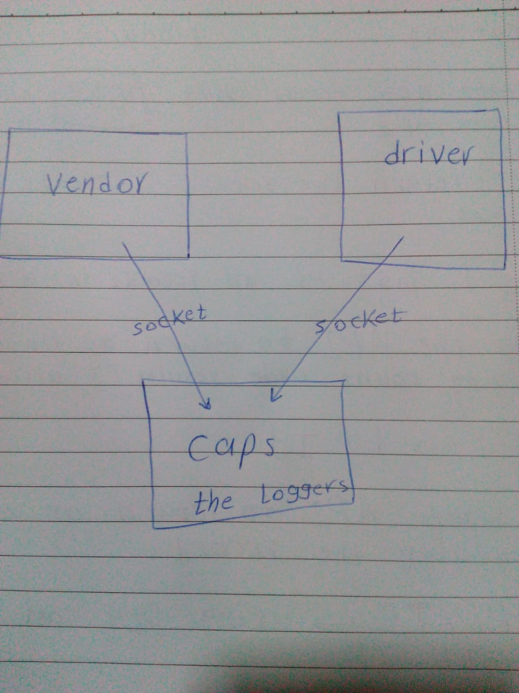

# LAB - Class 12

## Project: caps

### Author: Esra'a Mamoun

### Links and Resources

- [submission PR - class-16](https://github.com/EsraaMamoun-401-advanced-javascript/caps/pull/1)
- [submission PR - class-17](https://github.com/EsraaMamoun-401-advanced-javascript/caps/pull/2)
- [ci/cd](https://github.com/EsraaMamoun-401-advanced-javascript/caps/actions) (GitHub Actions)
<!-- - [back-end server url](http://xyz.com) (when applicable) -->
<!-- - [front-end application](http://xyz.com) (when applicable) -->

### Setup

<!-- #### Routs -->
#### `.env` 
PORT=3000
HOST

### Modules
- caps.js
- driver.js
- vendor.js
<!-- - model.js -->

### Packages
- eslint
- faker
- jest

#### How to initialize/run your application (where applicable)

- `node caps.js`
- `node driver.js`
- `node vendor.js`
<!-- #### How to use your library (where applicable)
- Lint Tests: `npm run lint` -->

#### Tests

* How do you run tests?
 > - Jest test: `npm test` 
 > - console.log
<!-- - Any tests of note?
- Describe any tests that you did not complete, skipped, etc -->

#### Notes: 
**Fatema helped me in refactor code class-16 to get the exact data as in the requirements**

#### UML
